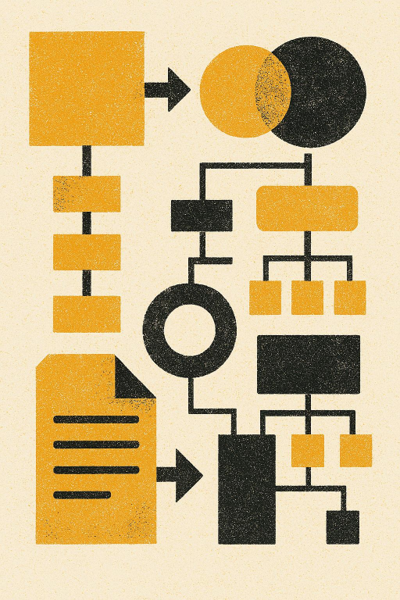

# Brief Technique #03 - ASCII Art pour Charts Statistiques

**Date:** 10 février 2026  
**Fonctionnalité ROADMAP:** #6 - Meilleure Gestion des Graphiques  
**Statut:** À Implémenter  
**Priorité:** 🟡 MOYENNE (Enhancement)  
**Complexité:** Modérée-Haute  
**Estimation:** 8h (Implémentation: 6h + Tests: 2h)  
**Dépendances:** BRIEF_01 (extraction d'images)

---

## 📋 Résumé Exécutif

### Vision
Améliorer la représentation des **charts statistiques PPTX** pour les LLMs en générant une **représentation ASCII art textuelle** en complément (ou remplacement) de l'image.

### Approche
Pour les charts statistiques (bar, pie, line), générer un ASCII art visuel :
```


```ascii-chart
  Q1: ████████░░░░░░░░░░ 45%
  Q2: ██████████████████░░ 78%
  Q3: ████████████████░░░░ 72%
  Q4: ████████████████████ 89%
```
```

### Bénéfices
- ✅ Représentation textuelle des données pour LLMs
- ✅ Complément visuel à l'image
- ✅ Meilleure extraction des valeurs numériques
- ✅ Applicable uniquement aux **charts** (pas aux images générales)

### ⚠️ Note Importante
Cette fonctionnalité est spécifique aux **charts statistiques** (bar, pie, line, column).
Les **images générales** ont leur propre traitement (voir [BRIEF_02_IMAGE_TEXT_DESCRIPTIONS.md](BRIEF_02_IMAGE_TEXT_DESCRIPTIONS.md)).

---

## 🎯 Objectifs Fonctionnels

### Objectif Principal
Détecter les charts statistiques dans les présentations PPTX et générer une représentation ASCII art des données numériques.

### Prérequis
- ✅ BRIEF_01 implémenté (sauvegarde d'images fonctionne)
- ✅ `python-pptx` disponible (déjà existant)

### Nouveaux Éléments
- ⚠️ Détection spécifique `shape.has_chart == True`
- ⚠️ Extraction des données du chart via `python-pptx`
- ⚠️ Génération ASCII art (caractères █ et ░)
- ⚠️ Format bloc ```ascii-chart
- ⚠️ Support types : bar, column, pie, line

---

## 📊 Types de Charts PPTX

### Types Supportés (Prioritaires)
1. **Bar Chart** (horizontal) → Barres horizontales
2. **Column Chart** (vertical) → Barres verticales
3. **Pie Chart** → Pourcentages avec barres
4. **Line Chart** → Tendance simplifiée

### Types Non Supportés (Future)
- Scatter
- Bubble
- Area
- Radar
- Donut

---

## 📝 Cas d'Usage

### Use Case 1 : Bar Chart Horizontal
```
Input:  presentation.pptx (avec bar chart)
Option: chart_ascii_art=True

Output:
  - output.md
  - images/slide1_image0.png

Exemple Markdown:


```ascii-chart
  Q1: ████████░░░░░░░░░░ 45%
  Q2: ██████████████████░░ 78%
  Q3: ████████████████░░░░ 72%
  Q4: ████████████████████ 89%
```
```

**Comportement:**
- Chart détecté via `shape.has_chart == True`
- Type déterminé : `XL_CHART_TYPE.BAR_CLUSTERED`
- Données extraites via `chart.series[0].values`
- ASCII art généré avec caractères █ (rempli) et ░ (vide)
- Image **affichée** + ASCII art en complément

### Use Case 2 : Pie Chart
```
Input:  presentation.pptx (avec pie chart)
Option: chart_ascii_art=True

Output:
```ascii-chart
  Product A: ██████████████████ 42%
  Product B: ████████████░░░░░░ 28%
  Product C: ███████░░░░░░░░░░░ 19%
  Product D: ████░░░░░░░░░░░░░░ 11%
```
```

### Use Case 3 : Chart Non Supporté (Fallback)
```
Input:  presentation.pptx (avec scatter chart)
Option: chart_ascii_art=True

Output:

(Aucun ASCII art - type non supporté)
```

**Comportement graceful:**
- Chart détecté mais type non supporté
- Image affichée normalement
- Pas d'erreur, pas d'ASCII art

### Use Case 4 : Mix Images + Charts + ASCII
```
Input:  presentation.pptx (1 photo + 1 bar chart)
Option: chart_ascii_art=True

Output:
  ← Image normale


```ascii-chart
  Q1: ████████░░ 45%
  Q2: ██████████████ 78%
```
```
```

**Comportement:**
- Images normales (`not shape.has_chart`) → affichées sans ASCII art
- Charts (`shape.has_chart`) → affichés + ASCII art si type supporté

---

## 🔧 Spécifications Techniques

### Nouveau Paramètre

| Paramètre | Type | Défaut | Description | Status |
|-----------|------|--------|---|---|
| `chart_ascii_art` | bool | `False` | Générer ASCII art pour charts statistiques | À implémenter |
| `ascii_chart_max_width` | int | `20` | Largeur max barres ASCII (caractères) | À implémenter |

### Format de Sortie

**Bloc de Code Markdown:**
```markdown
```ascii-chart
[Lignes de données avec barres ASCII]
[Format: Label: ████░░░░ Valeur%]
```
```

**Caractères Utilisés:**
- `█` (U+2588) : Bloc plein (rempli)
- `░` (U+2591) : Bloc léger (vide)

### Extraction des Données

**Via python-pptx:**
```python
chart = shape.chart
chart_type = chart.plots[0].chart_type  # XL_CHART_TYPE enum
series = chart.series[0]  # Première série
categories = [cat.label for cat in chart.plots[0].categories]
values = series.values  # Liste de valeurs numériques
```

**Mapping Types:**
```python
from pptx.enum.chart import XL_CHART_TYPE

supported_types = {
    XL_CHART_TYPE.BAR_CLUSTERED: "bar",
    XL_CHART_TYPE.COLUMN_CLUSTERED: "column",
    XL_CHART_TYPE.PIE: "pie",
    XL_CHART_TYPE.LINE: "line",
}
```

---

## 🏗️ Architecture de l'Implémentation

### Principes

1. **Aucune nouvelle dépendance**
   - ✅ Utiliser uniquement `python-pptx` (existant)
   - ✅ Standard library uniquement

2. **Modularité**
   - ✅ Nouvelles méthodes `_generate_*_ascii()`
   - ✅ Marqueurs `# --- MODULE: Chart ASCII Art ---`

3. **Fallback gracieux**
   - ✅ Type non supporté → pas d'ASCII art (pas d'erreur)
   - ✅ Extraction échoue → pas d'ASCII art (pas d'erreur)

### Fichier à Modifier

**Fichier:** `packages/markitdown/src/markitdown/converters/_pptx_converter.py`

### Nouvelles Méthodes

#### 1. Détection du Type de Chart

```python
# --- MODULE: Chart ASCII Art (BRIEF_03) ---
def _get_chart_type(self, chart):
    """
    Détermine le type de chart pour génération ASCII art.
    
    Returns:
        str: "bar", "column", "pie", "line", ou "unknown"
    """
    try:
        from pptx.enum.chart import XL_CHART_TYPE
        
        chart_type = chart.plots[0].chart_type
        
        type_map = {
            XL_CHART_TYPE.BAR_CLUSTERED: "bar",
            XL_CHART_TYPE.BAR_STACKED: "bar",
            XL_CHART_TYPE.COLUMN_CLUSTERED: "column",
            XL_CHART_TYPE.COLUMN_STACKED: "column",
            XL_CHART_TYPE.PIE: "pie",
            XL_CHART_TYPE.LINE: "line",
            XL_CHART_TYPE.LINE_MARKERS: "line",
        }
        
        return type_map.get(chart_type, "unknown")
    except Exception:
        return "unknown"
# --- END MODULE ---
```

#### 2. Génération ASCII - Bar Chart

```python
# --- MODULE: Chart ASCII Art (BRIEF_03) ---
def _generate_bar_chart_ascii(self, chart, max_width=20):
    """
    Génère ASCII art pour bar chart horizontal.
    
    Exemple:
      Q1: ████████░░░░ 45%
      Q2: ████████████░░ 78%
    
    Args:
        chart: Chart object python-pptx
        max_width: Largeur max barres (caractères)
    
    Returns:
        str ou None
    """
    try:
        series = chart.series[0]
        categories = [cat.label for cat in chart.plots[0].categories]
        values = series.values
        
        if not values or max(values) == 0:
            return None
        
        max_value = max(values)
        lines = []
        
        for cat, val in zip(categories[:10], values[:10]):  # Max 10 lignes
            if val is None:
                continue
            
            # Calculer proportion
            percentage = (val / max_value) * 100
            filled = int((val / max_value) * max_width)
            empty = max_width - filled
            
            # Générer barre
            bar = "█" * filled + "░" * empty
            lines.append(f"  {cat}: {bar} {percentage:.0f}%")
        
        return "\n".join(lines) if lines else None
    
    except Exception:
        return None
# --- END MODULE ---
```

#### 3. Génération ASCII - Pie Chart

```python
# --- MODULE: Chart ASCII Art (BRIEF_03) ---
def _generate_pie_chart_ascii(self, chart, max_width=20):
    """
    Génère ASCII art pour pie chart (barres proportionnelles).
    
    Exemple:
      Segment A: ██████████████████ 42%
      Segment B: ████████████░░░░░░ 28%
    """
    try:
        series = chart.series[0]
        categories = [cat.label for cat in chart.plots[0].categories]
        values = series.values
        
        total = sum(v for v in values if v is not None)
        if total == 0:
            return None
        
        lines = []
        
        for cat, val in zip(categories[:10], values[:10]):
            if val is None:
                continue
            
            percentage = (val / total) * 100
            filled = int((val / total) * max_width)
            empty = max_width - filled
            
            bar = "█" * filled + "░" * empty
            lines.append(f"  {cat}: {bar} {percentage:.0f}%")
        
        return "\n".join(lines) if lines else None
    
    except Exception:
        return None
# --- END MODULE ---
```

#### 4. Génération ASCII - Dispatcher

```python
# --- MODULE: Chart ASCII Art (BRIEF_03) ---
def _generate_ascii_chart(self, chart, max_width=20):
    """
    Génère ASCII art selon type de chart.
    
    Returns:
        str ou None
    """
    chart_type = self._get_chart_type(chart)
    
    if chart_type == "bar":
        return self._generate_bar_chart_ascii(chart, max_width)
    elif chart_type == "column":
        return self._generate_bar_chart_ascii(chart, max_width)  # Même format
    elif chart_type == "pie":
        return self._generate_pie_chart_ascii(chart, max_width)
    elif chart_type == "line":
        # TODO: Implémenter si nécessaire
        return None
    else:
        return None
# --- END MODULE ---
```

#### 5. Intégration dans `get_shape_content()`

```python
# --- MODULE: Chart ASCII Art (BRIEF_03) ---
# APRÈS affichage de l'image du chart

if self._is_picture(shape) and shape.has_chart:
    # Image déjà affichée par BRIEF_01
    
    # Générer ASCII art si demandé
    if kwargs.get("chart_ascii_art", False):
        try:
            max_width = kwargs.get("ascii_chart_max_width", 20)
            ascii_art = self._generate_ascii_chart(shape.chart, max_width)
            
            if ascii_art:
                md_content += f"\n```ascii-chart\n{ascii_art}\n```\n"
        except Exception:
            # Fallback graceful : pas d'ASCII art
            pass
# --- END MODULE ---
```

---

## 🧪 Tests

### Test 1 : Bar Chart avec ASCII
**Input:** PPTX avec 1 bar chart  
**Option:** `chart_ascii_art=True`  
**Expected:**
```
✅ images/slide1_image0.png créé
✅ Image affichée : 
✅ Bloc ascii-chart présent
✅ Format correct : Label: ████░░░░ XX%
```

### Test 2 : Pie Chart avec ASCII
**Input:** PPTX avec 1 pie chart  
**Option:** `chart_ascii_art=True`  
**Expected:**
```
✅ ASCII art généré avec proportions correctes
✅ Total = 100%
```

### Test 3 : Chart Non Supporté (Graceful)
**Input:** PPTX avec scatter chart  
**Option:** `chart_ascii_art=True`  
**Expected:**
```
✅ Image affichée normalement
✅ Aucun ASCII art (pas d'erreur)
```

### Test 4 : Sans Option (Régression)
**Input:** PPTX avec chart  
**Option:** `chart_ascii_art=False` (défaut)  
**Expected:**
```
✅ Image affichée normalement
✅ Aucun ASCII art
✅ Comportement identique à BRIEF_01
```

### Test 5 : Chart + Largeur Personnalisée
**Input:** PPTX avec bar chart  
**Option:** `chart_ascii_art=True, ascii_chart_max_width=40`  
**Expected:**
```
✅ Barres ASCII plus larges (40 caractères)
```

---

## 📋 Plan d'Implémentation

### Sprint 1 : Détection & Infrastructure (2h)
- [ ] Implémenter `_get_chart_type()`
- [ ] Mapper types python-pptx → noms simples
- [ ] Tests détection sur différents types

### Sprint 2 : Génération ASCII (3h)
- [ ] Implémenter `_generate_bar_chart_ascii()`
- [ ] Implémenter `_generate_pie_chart_ascii()`
- [ ] Implémenter `_generate_ascii_chart()` (dispatcher)
- [ ] Tests génération

### Sprint 3 : Intégration & Tests (3h)
- [ ] Intégrer dans `get_shape_content()`
- [ ] Tests 1-5 validés
- [ ] Vérifier coexistence avec BRIEF_01 et BRIEF_02
- [ ] Edge cases (charts vides, valeurs nulles)

**Estimation Totale:** 8h

---

## ✅ Conditions d'Acceptation

- [ ] Charts détectés via `shape.has_chart`
- [ ] Types supportés : bar, column, pie
- [ ] ASCII art généré avec caractères █ et ░
- [ ] Bloc ```ascii-chart dans Markdown
- [ ] Image **affichée** + ASCII art en complément
- [ ] Fallback graceful (type non supporté)
- [ ] Paramètre `ascii_chart_max_width` fonctionnel
- [ ] Tests 1-5 passent tous
- [ ] BRIEF_01 et BRIEF_02 non affectés

---

## 🔄 Dépendances

### Prérequis
- ✅ **BRIEF_01** implémenté (sauvegarde d'images)
- ✅ `python-pptx` disponible

### Impact
- ⚠️ Ajoute nouvelles méthodes dans `_pptx_converter.py`
- ⚠️ Complète traitement des charts (après BRIEF_01)
- ✅ Aucune nouvelle dépendance externe

### Interaction avec autres Briefs

**BRIEF_01 (Extraction Images):**
- Chart détecté → image sauvegardée (BRIEF_01)
- Chart détecté → ASCII art ajouté (BRIEF_03)

**BRIEF_02 (Descriptions Textuelles Images):**
- Images normales → traitement BRIEF_02
- Charts → exclus de BRIEF_02, traités par BRIEF_03

**Ordre d'exécution:**
1. BRIEF_01 : Sauvegarde image
2. BRIEF_02 : Si image normale ET `image_text_description=True` → bloc texte
3. BRIEF_03 : Si chart ET `chart_ascii_art=True` → ASCII art

---

## 📚 Références

- **Fichier:** [`_pptx_converter.py`](packages/markitdown/src/markitdown/converters/_pptx_converter.py)
- **Dépendance:** `python-pptx` - [docs](https://python-pptx.readthedocs.io/en/latest/api/chart.html)
- **ROADMAP:** Fonctionnalité #6
- **Prérequis:** [BRIEF_01_IMAGE_EXTRACTION.md](BRIEF_01_IMAGE_EXTRACTION.md)
- **Complémentaire:** [BRIEF_02_IMAGE_TEXT_DESCRIPTIONS.md](BRIEF_02_IMAGE_TEXT_DESCRIPTIONS.md)

---

## 🎯 Questions Ouvertes

1. **Line Charts** :
   - Représentation ASCII difficile (graphe 2D)
   - Recommandation : Lister valeurs uniquement (pas de visualisation)

2. **Column Charts verticaux** :
   - Même traitement que bar charts (barres horizontales)
   - Alternative : Rotation 90° (complexe en ASCII)

3. **Charts multiples séries** :
   - Actuellement : Série 0 uniquement
   - Future : Support séries multiples avec couleurs ASCII différentes

---

**Prochaines étapes:** 
1. Implémenter BRIEF_01 (extraction images)
2. Implémenter BRIEF_02 (descriptions textuelles images)
3. Implémenter BRIEF_03 (ASCII art charts)

Voir [MON_ROADMAP.md](MON_ROADMAP.md) pour vision globale.
